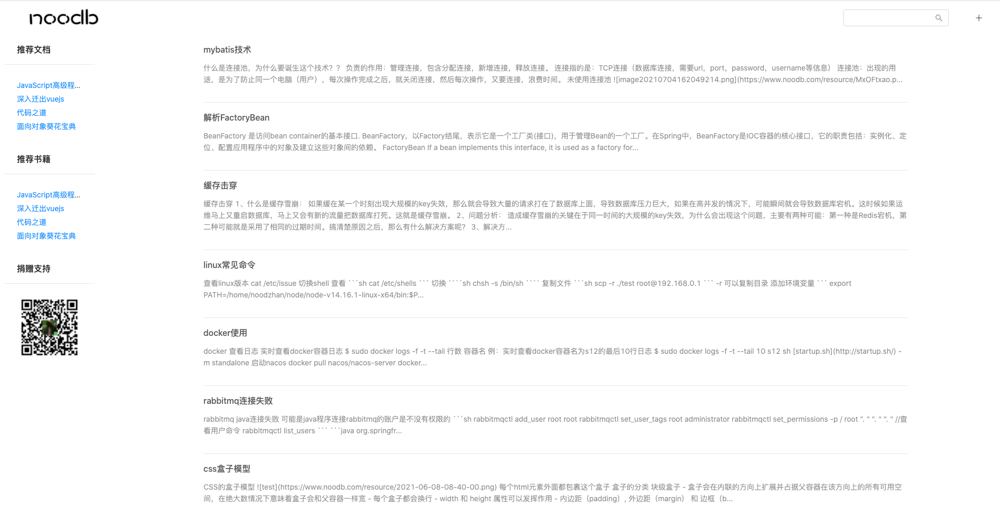
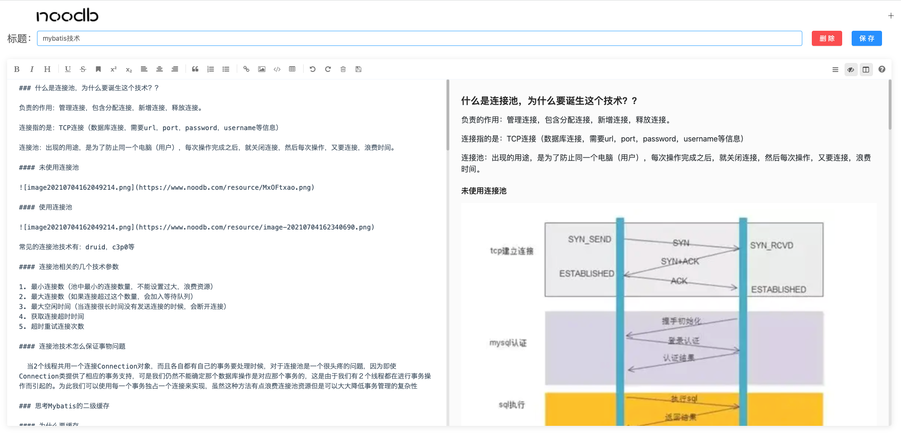
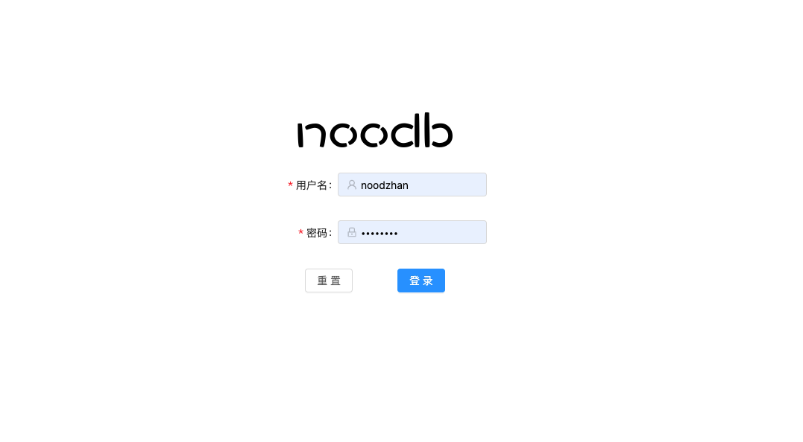

# noodb.com

## 设计初衷

开发该个人博客网站，主要是为了记录工作或学习中的，一些个人笔记，便于以后出现问题可以快速定位；设计初衷就是为了类似
wiki 一样，留下一些个人学习记录。以后有时间，查询改为全文检索。

## 总体预览







### 技术实现

    springboot 2.4.5
    MySQL 8.0
    MybatisPlus 3.4.3
    gradle 7.1.1
    vue 2.6.11
    antd 1.7.7
    marked 2.0.7
    mavon-editor 2.9.1
    nuxt 2.14.5
    node 16.15

### 更新日志

#### 1.0.0

【新增】博客首页，分页渲染博客列表

【新增】查看博客详情

【新增】临时推荐文档，书籍；捐赠支持功能

【新增】支持博客编辑，必须是登录后才能修改

【新增】博客目录树

【新增】发布博客

【优化】首页展示推荐书籍和文档样式

【新增】博客编辑支持上传图片

### 1.0.1

1. 【优化】使用 nuxt 实现服务端渲染
2. 【优化】搜索使用 lucene
3. 【新增】引用百度统计来统计博客的访问量。
4. 【优化】使用 markdown-it 渲染 markdown 语法，markedjs 渲染太丑。
5. 【新增】实现自动部署 nuxtapp
6. 【新增】github 添加 CI
7. 【新增】优化 SEO

### 2.0.0

1. 【新增】刷 leetcode 题目，自动同步到本博客。
2. 【新增】支持gradle自动发release包。

### 需求

#### 刷 leetcode 题目，自动同步到 noodb 个人博客。

技术实现：

1. 使用 tampermonkey，写一个脚本插件。
2. 全局拦截一下 LeetCode 的提交代码请求，然后响应正确的话，就直接将代码代码和题目信息，同步到个人博客中。

## 启动

数据库脚本

使用数据库客户端，执行目录下`back-end/db/createTable.sql`文件。

前端 （front-end）

```
npm install

npm run serve
```

前端 （nuxtapp）

```
npm install

npm run dev
```

后台 （back-end）

开发启动

```shell
java -jar -Dspring.profiles.active=dev back-end.jar
```

## 发布

在项目的根目录执行下面命令，会在产生release包。

```shell
./gradlew release
```

## 部署

### 前端（不使用服务端渲染）

```shell
scp -i ~/.ssh/id_rsa -r /Users/noodzhan/IdeaProjects/noodb/front-end/dist ubuntu@1.15.231.74:/home/ubuntu/nblog/front-end
```

### 前端（使用服务端渲染nuxt）

1. 上传到服务器

```shell
scp -i ~/.ssh/id_rsa -r ./.nuxt nuxt.config.js package.json package-lock.json ./static ubuntu@1.15.231.74:/home/ubuntu/nblog/nuxtapp
```

2. 进入相关目录

```shell
cd /home/ubuntu/nblog/nuxtapp
```

3. 安装依赖

```shell
npm install
```

4. 后台执行 nuxt

```shell
nohup npm run start &
```

5. 验证是否启动

```shell
curl http://localhost:3000
```

注意： 杀掉 npm 进程，可能没有用。必须杀掉 3000 端口占用的进程。

查看端口占用进程

```shell
lsof -i:3000
```

### 后台

#### jar

```shell

scp -i ~/.ssh/id_rsa /Users/noodzhan/IdeaProjects/noodb/back-end/build/libs/back-end-1.0.0.jar ubuntu@1.15.231.74:/home/ubuntu/nblog/noodb-blog-jar

```

```shell
nohup java -jar -Dspring.profiles.active=dev back-end.jar &
```

#### nginx 配置

```shell
scp -i ~/.ssh/id_rsa nblog-nginx.conf ubuntu@1.15.231.74:/etc/nginx/conf.d

```

```shell
nginx -t
```

```shell
nginx -s reload
```

#### 部署calibre

1. 搜索

```shell
dokcer search calibre-web
```

2. 拉取镜像

```shell
docker pull johngong/calibre-web
```

3. 启动

```shell
docker run -d \
--name=calibre-web \
-p 8083:8083 \
-v /home/ubuntu/calibre-web/config:/config \
-v /home/ubuntu/calibre-web/library:/library \
--restart unless-stopped \
johngong/calibre-web
```

## tamperMonkey(插件)

#### 使用背景

主要是 chrome 的 cookie
信息，来利用`https://github.com/wechatsync/Wechatsync`这个库来实现，一键
publish ，同步到各个博客网站。不符合后台同步博客的需求。

#### 开发环境整理

1. 复制下面到 tamperMonkey 的 js 里面

```js
// ==UserScript==
// @name         axios_test
// @namespace    http://tampermonkey.net/
// @version      0.1
// @description  try to take over the world!
// @author       You
// @match        https://noodb.com/*
// @icon         data:image/gif;base64,R0lGODlhAQABAAAAACH5BAEKAAEALAAAAAABAAEAAAICTAEAOw==
// @grant        none
// ==/UserScript==

(function () {
    "use strict";
    console.error("test");
    if (location.href === "http://localhost:8080/") return;
    window.onload = function () {
        var script = document.createElement("script");
        script.src = "http://localhost:8080/main.bundle.js";
        document.body.appendChild(script);
    }

})();
```

2. 进入 tool 文件夹里面，执行

```
npm run serve
```

## 安全 (对接springSecurity)

1、没有accessToken的请求，操作博客文档，进行拦截。暂时不做权限控制。

2、登录接口颁发accessToken。

3、实现一下这个过滤器。

BearerTokenAuthenticationFilter
